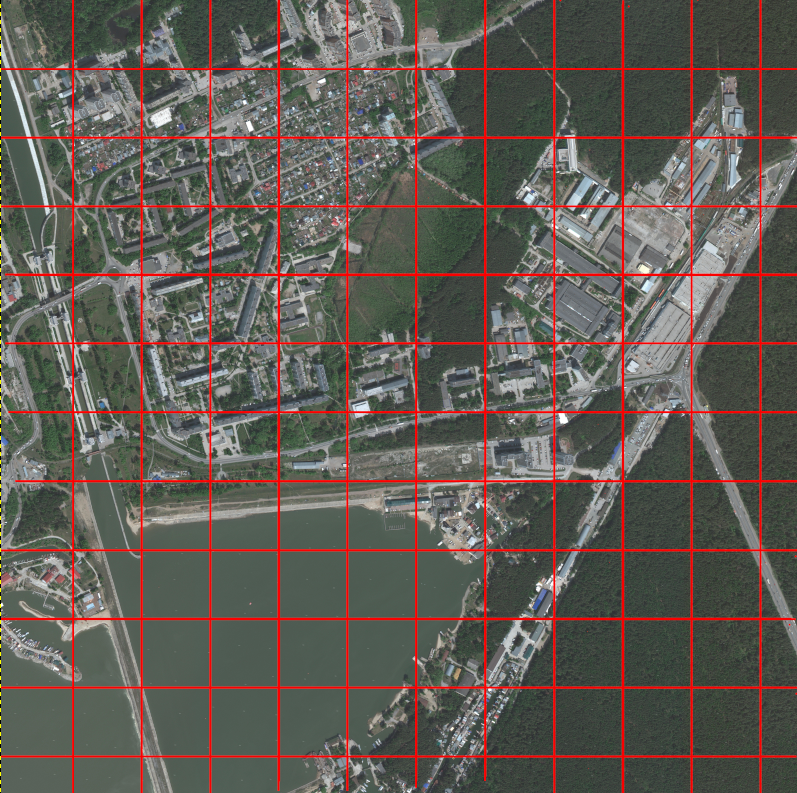
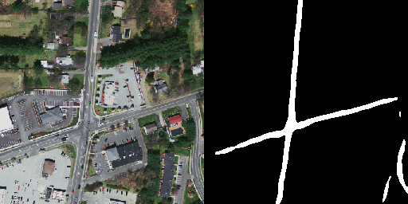

# RKNPU2
## YOLOv5


```
photo --> YOLOv5 --> bbox centers
```
## ResNet


```
photo --> ResNet --> index, crop (localization)
crop --> SIFT --> scale, angle (and orientation)
```

## UNet


```
photo --> UNet --> mask
```

## AutoEncoder


```
photo --> AE --> vector
vector --> db --> index, scale, angle (localization and orientation)
```

# ONNX2RKNN convert
Unet
```
python3 unet_onnx2rknn.py \
        --input path-to-your-onnx-model \
        --output path-where-save-rknn-model \
        --dataset path-to-txt-file-with-calibration-images-names
```
ResNet
```
python3 resnet2rknn.py \
        --input path-to-your-pt-model \
        --output path-where-save-rknn-model \
        --dataset path-to-txt-file-with-calibration-images-names
```
