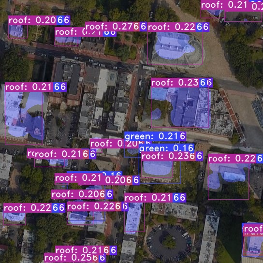

# UAV navigation based on Firefly ROC-RK3588S
## YOLOv5


```
photo --> YOLOv5 --> bbox centers
```
## YOLACT


```
photo --> YOLACT --> mask, bbox centers
```
## ResNet


```
photo --> ResNet --> index, crop (localization)
crop --> SIFT --> scale, angle (and orientation)
```

## UNet


```
photo --> UNet --> mask
```

## AutoEncoder


```
photo --> AE --> vector
vector --> db --> index, scale, angle (localization and orientation)
```

# rknn toolkit lite2

## Install
Install miniconda
```
wget https://repo.anaconda.com/miniconda/Miniconda3-latest-Linux-aarch64.sh
bash Miniconda3-latest-Linux-aarch64.sh
```
Create conda python3.9 - env
```
conda create -n <env-name> python=3.9
```
Activate virtualenv
```
conda activate <env-name>
```
Install RKNN-Toolkit2-Lite
```
cd drone_RK3588/install/
pip install -r requirements.txt
pip install rknn_toolkit_lite2-1.4.0-cp39-cp39-linux_aarch64.whl
```
